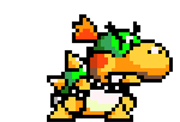
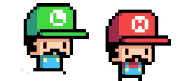

# **BOWSER ATTACK**
---
Bowser has returned again!!! While Mario and Luigi was throwing the most epic party in Mushroom Land ever, Bowser came and crashed the party becasue he was not invited. Bowser came down from the roof soooo hard that he went through the floor and sent Mario and Luigi both down to Bowser's underground castle. Can Mario and Luigi survive Bowsers attack and return to their epic mushroom party?

 

Mario(PLayer1) and Luigi(Player2) will take turn to play the game. Bowser will move around on the screen and randomly shoots bouncing fire ballz to hurt Mario and Luigi becasue he is mad. Try to avoid Bowsers ballz as long as you can and survive the attack!

Star Power(makes you invisible for 10 sec) will appear randomly on the map. Move your character over it to get the effect of the star.

Play Bowser Attack [HERE](https://kw23085.github.io/Bowser-Attack/)

---
# Development & Technologies

Bowser Attack is built using HTML, CSS, JavaScript, and the jQuery library

---
# User Stories
- When landing on the page I am greeted by some message to set the scene of the game.
- I'd like the game to make me feel intense.
- I'd like to compete with friends.
- I want to feel the sence of accomplishment when I completed the game.
- When I failed I'd like to be able to play the game again.

---
# MVP
- Boss(Bowser) randomly moves around the screen.
- Boss(Bowser) randomly shoots out fireballs every 2.7 seconds.
- A timer to count the total surviving time of a player.
- SuperStarPower appears randomly on the map every 27 seconds.
- Players takes turn to play the game.
- Player is able to control his/her character with mouse curser.

---
# Advanced Features
- Player 1 and 2 can play the game at the same time.
- Players will have health bars.
- More items could be generated randomly for different effects.
- Use keyboards to control the character.
- Score board that shows top 10 high scores.